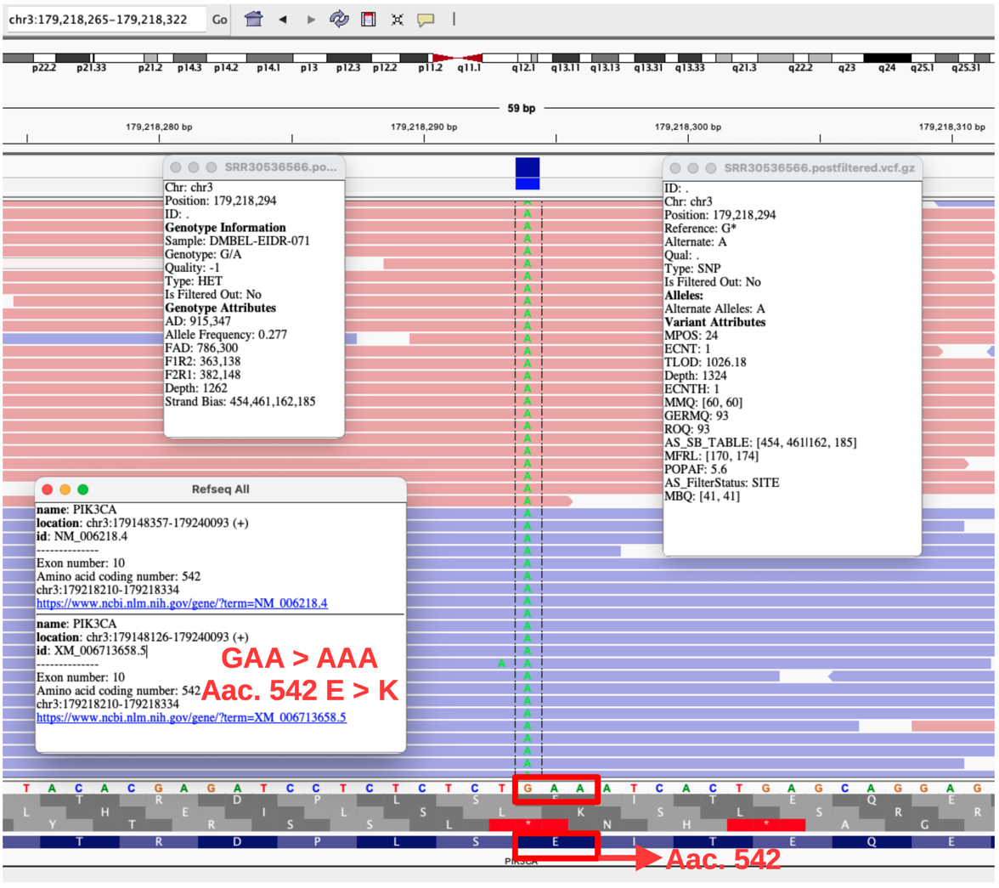
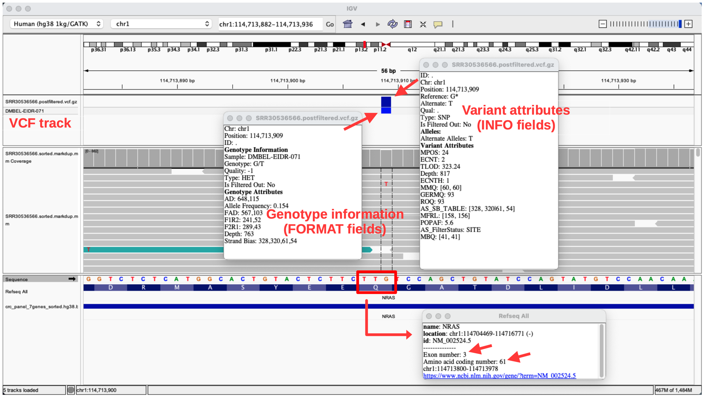

# Repository Overview  

This repository contains curated examples of my bioinformatics workflows, spanning somatic NGS, bulk RNA-seq, single-cell V(D)J profiling and spatial transcriptomics analyses. Below is a brief description of each file. More files and annotations will be added shortly. 

# Somatic NGS pipeline of matched tumor-normal pair

A reproducible bash script pipeline for the analysis of matched tumor-normal FASTQ samples from colorectal cancer patient, following GATK Best Practices using the **Mutect2** variant caller and functional annotation via the Ensembl Variant Effect Predictor (VEP).

**Bash pipeline**: [`bash_somatic_ngs_PRJNA1156316_TN.sh`](bash_somatic_ngs_PRJNA1156316_TN.sh)

**Somatic analysis report (clinically actionable) of post-filtered variants** 

| Location       | Gene       | HGVSc     | HGVSp       | Consequence | Exon   |  VAF      | TLOD   | SIFT        | PolyPhen          | ClinVar            | ClinPred  | Evidence   |
|----------------|------------|-----------|-------------|-------------|--------|-----------|--------|-------------|-------------------|--------------------|-----------|------------|
|**1:114713909** | **NRAS**   | c.181C>A  |  p.Gln61Lys | Missense    | 3/7    | 0.154     | 318.08 | Deleterious | -                 | Pathogenic         | 0.984     | ✅ Hotspot |
|**3:179218294** | **PIK3CA** | c.1624G>A |  p.Glu542Lys| Missense    | 10/21  | 0.277     | 1253   | Deleterious | Probably damaging | Likely pathogenic  | 0.880     | ✅ Hotspot |
  
  
**Visualization of PIK3CA G>A variant with IGV (Integrative genomics viewer)**

  

**Visualization of NRAS C>A variant with IGV** (**NOTE**: NRAS gene is encoded on the reverse strand)   
  

---

# Mouse Bulk RNA-seq Pipeline 

End-to-end reproducible nextflow and R pipelines designed for processing raw transcriptomic reads to differential expression

## 1. Quality Control and Trimming of `fastq.gz` Files.

### Processes
- MD5 checksum validation
- FastQC on raw and trimmed reads
- Trim Galore (adapter and quality trimming)
- MultiQC report aggregation

**Nextflow Pipeline:** [`main_fastqc_multiqc_trimming.nf`](main_fastqc_multiqc_trimming.nf)

## 2. Alignment and Gene Count Quantification.

### Processes
- Alignment using HISAT2
- Identification of duplicates  
- Feature counts
- QC metrics (rRNA counts, strandedness, raw duplicates)
- MultiQC

**Nextflow Pipeline:**
- [`main_analysis_prebuilt_HISAT2_only_FeatCounts_multi_vM25.nf`](main_analysis_prebuilt_HISAT2_only_FeatCounts_multi_vM25.nf)
- [`vM25_multiqc_config.yaml`](vM25_multiqc_config.yaml)

## 3. Differential Expression Analysis

### Processes
- Count matrix generation from raw counts
- Data cleaning and transformation
- PCA visualization
- DESeq2-based differential expression
  - MA and volcano plots
  - DEG tables
- Gene Set Enrichment Analysis (GSEA)

**R Script:** [`bulk_RNAseq_count_matrix_DESeq2.R`](bulk_RNAseq_count_matrix_DESeq2.R)

**Volcano plot: Differential expression analysis comparing Liver vs. Muscle tissue (Red: upregulated in Liver; Blue: upregulated in Muscle).**

---

# Spatial transcriptomics Pipeline

## 1. 10X Genomics Visium Workflow (Mouse Brain Coronal Section)
An R-based spatial analysis resolving transcriptomic architecture across histological structures.  

### Processes
- Spatial data loading and quality control
- Data pre-processing
- Dimensionality reduction and clustering
- Summary table of spot identifiers and spot count
- DEG analysis of spatial clusters
- Brain region annotation (anatomical annotation/labeling)
- Flextable of highly expressed genes per brain region

**R Quarto Document:** 
The main analysis is implemented in a single R Quarto file located in the `spatial_mouse_brain/` directory:  
[`spatial_mouse_brain/260225_Spatial_Mouse_Brain_Coronal_10x.qmd`](spatial_mouse_brain/260225_Spatial_Mouse_Brain_Coronal_10x.qmd)

An HTML-rendered version of the Quarto document is also included, along with its associated resources:
- [`spatial_mouse_brain/260225_Spatial_Mouse_Brain_Coronal_10x.html`](spatial_mouse_brain/260225_Spatial_Mouse_Brain_Coronal_10x.html)  
- [`spatial_mouse_brain/260225_Spatial_Mouse_Brain_Coronal_10x_files/`](spatial_mouse_brain/260225_Spatial_Mouse_Brain_Coronal_10x_files/)

### Key Visual Outputs

The following figures provide visual summaries of the spatial transcriptomics analysis:

- **Mouse Brain Section Region Annotation**  
  [Spatial regions annotated](spatial_mouse_brain/Spatial_Visium_mouse_brain_regionsNoLegends.png)

- **Composite View – H&E + Annotation + UMAP**  
  

- **Table: Descriptive Stats per Brain Region**  
  [Descriptive table of brain regions](spatial_mouse_brain/ft_region_brainregions_descriptive_table.png)

- **Table: Top 5 Predictive Genes per Brain Region (AUC Ranking)**  
  [Top marker genes per region](spatial_mouse_brain/ft_markers_brainregions_Top5_predictive_genes_table.png)

## 2. NanoString CosMx workflow (Human Pancreas FFPE)  

An R-based spatial analysis of a 18,946-plex whole-transcriptome spatial dataset resolving human pancreatic architecture.

### Overall description from Nanostring website

<https://nanostring.com/products/cosmx-spatial-molecular-imager/ffpe-dataset/cosmx-smi-human-pancreas-ffpe-dataset/>

**Data Source**: Publicly available Human Pancreas FFPE dataset from NanoString CosMx SMI (18,946-plex Whole Transcriptome Panel).   
**Data Management**: Implemented automated data transfer and extraction strategies for large-scale spatial flat files on AWS EC2 instances.

### Steps
1.  Import CosMx dataset into AWS-EC2 and decompress it
2.  Load the CosMx dataset into RStudio Server (continue by creating Seurat object, preprocessing, etc).
3.  Visualizations: UMAP and tissue/cell type characterization
4.  Tabular visualization of exportable file
5.  Convert Seurat object metadata in H5AD → **R/Python Interoperability**

**R Quarto Document:** 
The main analysis is implemented in a single R Quarto file located in the `proj6_pancreas_human_CosMx_figs/` directory:

[`proj6_pancreas_human_CosMx_figs/proj6_Spatial_Pancreas_doppelg_EC2_git.qmd`](proj6_pancreas_human_CosMx_figs/proj6_Spatial_Pancreas_doppelg_EC2_git.qmd)

### Key Visual Outputs

The following figures provide visual summaries of the spatial transcriptomics analysis of human pancreas in a single-cell manner. Cell annotation was based on cell markers from Azimuth reference: 
<https://azimuth.hubmapconsortium.org/references/#Human%20-%20Pancreas>

- **UMAP: Cell type annotation: Exocrine (ductal and acinar cells), Endocrine (alpha, beta, gamma/b/a and delta) and Interstitial (stellate, endothelial and macrophages) cells**  
  

- **Table: Distribution of pancreatic cell types in human**  
  

- **Cell/hormone image: Zoomed visualization of pancreas slice, highlighting some endocrine cells based on the hormone they express. INS: Insulin (beta cells), GCG: Glucagon (alpha cells), GHRL: Ghrelin (epsilon cells), PPY: Pancreatic Polypeptide (gamma cells)**  
  
 
- **Cell/hormone image2: Zoomed visualization of pancreas slice, highlighting some of the most important hormones and some cell markers**  
  
  
- **Tissue/Cell image: Zoomed visualization of pancreas slice, highlighting endocrine, exocrine and interstitial cell types**  
  

---

# V(D)J Single-Cell Profile Analysis (TCR/BCR) clonotype and cluster annotation analysis

An R-based analysis of immune receptor repertoires from healthy human PBMC samples using 10X Genomics datasets.

### Processes
- Combination of contigs
- V(D)J chain pairing (alpha/beta for TCR; heavy/light for BCR)
- Clonal visualizations (CDR3 clonal frequency and repertoire diversity)
- Quantification/frequency of clones
- Quality control analysis and cell filtering
- Data normalization and preprocessing
- PCA and determination of dimensionality
- Cell clustering
- Cell annotation and differential gene expression per cluster

**PDF Document:**
- [`2024_ABI_Internship_UMM_PartI.pdf`](2024_ABI_Internship_UMM_PartI.pdf)
- [`2024_ABI_Internship_UMM_PartII.pdf`](2024_ABI_Internship_UMM_PartII.pdf)

---

# Cloud Bioinformatics (AWS EC2)  

### Setup infrastructure, Pipeline Execution, and Cost-Control for High-Performance FASTQ Processing

A technical protocol detailing cloud-native architecture deployment for high-performance bioinformatic processing of large-scale datasets using Amazon Web Services (AWS) EC2 instances. It includes:

- Instance setup and security configuration
- Installation of bioinformatics tools
- FASTQ transfer to/from cloud
- Pipeline execution using Nextflow
- Cost monitoring and resource cleanup
- Multi-factor authentication (MFA) setup
- Secure AWS CLI configuration

**Protocol File:** [`Cloud_Bioinformatics_Nextflow_BasicTutorial_AWS_EC2.txt`](Cloud_Bioinformatics_Nextflow_BasicTutorial_AWS_EC2.txt)

---
