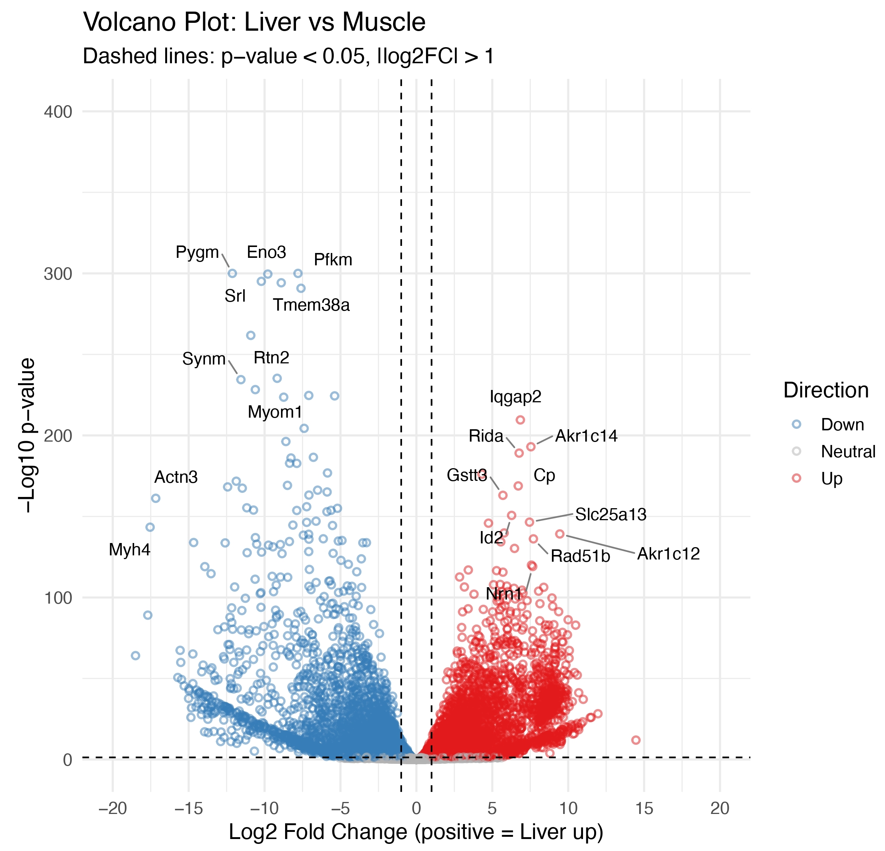
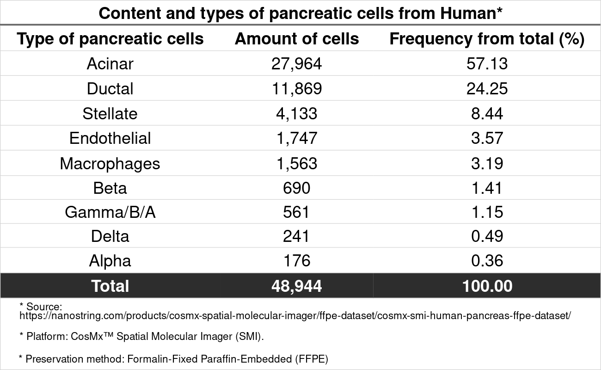
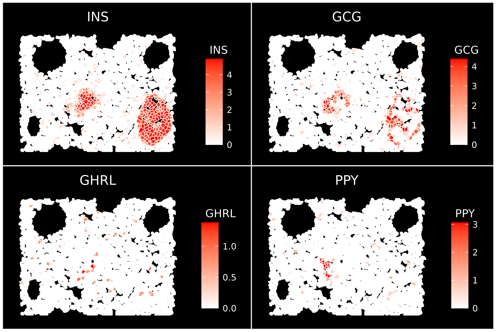
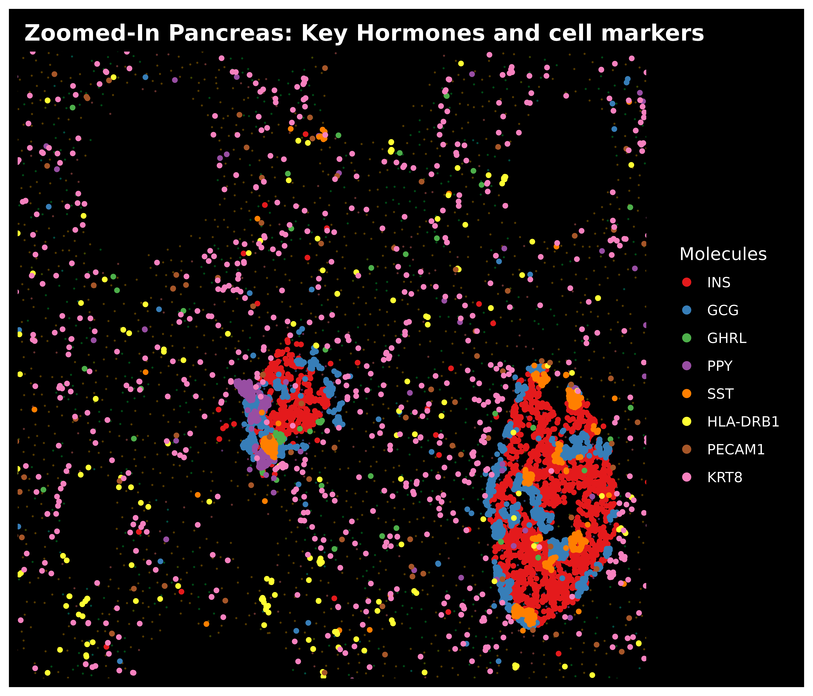
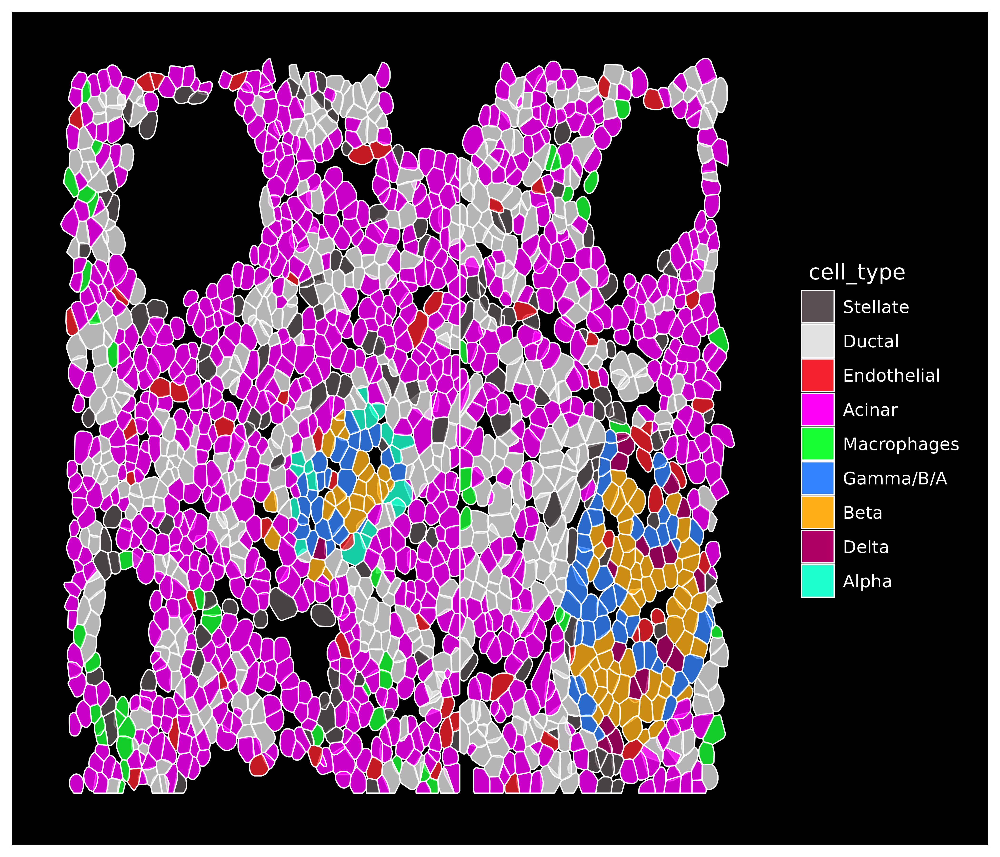

# Repository Overview

This repository contains curated examples of my bioinformatics work, spanning bulk RNA-seq and spatial transcriptomics analyses. Below is a brief description of each file. More files and annotations will be added shortly.

# Mouse Bulk RNA-seq Pipeline

## 1. Quality Control and Trimming of `fastq.gz` Files.

### Processes
- MD5 checksum validation
- FastQC on raw and trimmed reads
- Trim Galore (adapter and quality trimming)
- MultiQC report aggregation

**Nextflow Pipeline:** [`main_fastqc_multiqc_trimming.nf`](main_fastqc_multiqc_trimming.nf)

## 2. Alignment and Gene Count Quantification.

### Processes
- Alignment using HISAT2
- Identification of duplicates  
- Feature counts
- QC metrics (rRNA counts, strandness, raw duplicates)
- MultiQC

**Nextflow Pipeline:**
- [`main_analysis_prebuilt_HISAT2_only_FeatCounts_multi_vM25.nf`](main_analysis_prebuilt_HISAT2_only_FeatCounts_multi_vM25.nf)
- [`vM25_multiqc_config.yaml`](vM25_multiqc_config.yaml)

## 3. Differential Expression Analysis

### Processes
- Count matrix generation from raw counts
- Data cleaning and transformation
- PCA visualization
- DESeq2-based differential expression
  - MA and volcano plots
  - DEG tables
- Gene Set Enrichment Analysis (GSEA)

**R Script:** [`bulk_RNAseq_count_matrix_DESeq2.R`](bulk_RNAseq_count_matrix_DESeq2.R)

**Volcano plot: Upregulated genes in liver (red) and muscle (blue) cells**

---

# Spatial transcriptomics Pipeline

## 1. R pipeline of 10X Genomics Visium dataset from mouse brain slice

### Processes
- Spatial data loading and quality control
- Data pre-processing
- Dimensionality reduction and clustering
- Summary table of spots identifiers and spot amount
- DEG analysis of spatial clusters
- Brain region annotation (anatomical annotation/labeling)
- Flextable of highly expressed genes per brain region

**R Quarto Document:** 
The main analysis is implemented in a single R Quarto file located in the `spatial_mouse_brain/` directory:  
[`spatial_mouse_brain/260225_Spatial_Mouse_Brain_Coronal_10x.qmd`](spatial_mouse_brain/260225_Spatial_Mouse_Brain_Coronal_10x.qmd)

An HTML-rendered version of the Quarto document is also included, along with its associated resources:
- [`spatial_mouse_brain/260225_Spatial_Mouse_Brain_Coronal_10x.html`](spatial_mouse_brain/260225_Spatial_Mouse_Brain_Coronal_10x.html)  
- [`spatial_mouse_brain/260225_Spatial_Mouse_Brain_Coronal_10x_files/`](spatial_mouse_brain/260225_Spatial_Mouse_Brain_Coronal_10x_files/)

### Key Visual Outputs

The following figures provide visual summaries of the spatial transcriptomics analysis:

- **Mouse Brain Section Region Annotation**  
  [Spatial regions annotated](spatial_mouse_brain/Spatial_Visium_mouse_brain_regionsNoLegends.png)

- **Composite View – H&E + Annotation + UMAP**  
  

- **Table: Descriptive Stats per Brain Region**  
  [Descriptive table of brain regions](spatial_mouse_brain/ft_region_brainregions_descriptive_table.png)

- **Table: Top 5 Predictive Genes per Brain Region (AUC Ranking)**  
  [Top marker genes per region](spatial_mouse_brain/ft_markers_brainregions_Top5_predictive_genes_table.png)

## 2. R pipeline of CosMx Nanostring dataset from human pancreas slice

### Overall description from Nanostring website

<https://nanostring.com/products/cosmx-spatial-molecular-imager/ffpe-dataset/cosmx-smi-human-pancreas-ffpe-dataset/>

"With CosMx™ Spatial Molecular Imager (SMI) we characterized human pancreas FFPE tissue with a 18,946 plex pre-commercial version of our CosMx Human Whole Transcriptome panel. 
This pre-commercial whole transcriptome panel showcases the highest plex of any spatial imager. 
With over 18,946 genes, this RNA panel offers researchers the ability to analyze the entire transcriptome at true single cell level at the highest plex."

In the above website, read the information and click on 'DOWNLOAD DATA'. Fill the form and wait that the 'Pancreas-CosMx-WTx-FlatFiles.zip' (dataset) downwloads completely.

### Processes
1.  Import CosMx dataset into AWS-EC2 and decompress it
2.  Load the CosMx dataset into RStudio Server (continue by creating seurat object, preprocessing, etc).
3.  Visualizations: UMAP and tissue/cell type characterization
4.  Tabular visualization of exportable file
5.  Convert seurat object metadata in H5AD

**R Quarto Document:** 
The main analysis is implemented in a single R Quarto file located in the `proj6_pancreas_human_CosMx_figs/` directory:

[`proj6_pancreas_human_CosMx_figs/proj6_Spatial_Pancreas_doppelg_EC2_git.qmd`](proj6_pancreas_human_CosMx_figs/proj6_Spatial_Pancreas_doppelg_EC2_git.qmd)

### Key Visual Outputs

The following figures provide visual summaries of the spatial transcriptomics analysis of human pancreas in a single-cell manner. Cell annotation was based on cell markers from Azimuth reference: 
<https://azimuth.hubmapconsortium.org/references/#Human%20-%20Pancreas>

- **UMAP: Cell type annotation: Exocrine (ductal and acinar cells), Endocrine (alpha, beta, gamma/b/a and delta) and Interstitial (stellate, endothelial and macrophages) cells**  
  

- **Table: Distribution of pancreatic cell types in human**  
  

- **Cell/hormone image: Zoomed visualization of pancreas slice, highlighting some endocrine cells based on the hormone they express. INS: Insuline (beta cells), GCG: Glucagon (alpha cells), GHRL: Ghrelin (epsilon cells), PPY: Pancreatic Polypeptide (gamma cells)**  
  
 
- **Cell/hormone image2: Zoomed visualization of pancreas slice, highlighting some of the most important hormones and some cell markers**  
  
  
- **Tissue/Cell image: Zoomed visualization of pancreas slice, highlighting endocrine, exocrine and interstitial cell types**  
  

---

# V(D)J TCR/BRC clonotype and cluster annotation analysis

## R pipeline of 10X Genomics dataset from healthy human PBMC sample

### Processes
- Combination of contigs
- Quantification of chains alleles per clone
- Frequencies of alleles
- Clonal visualizations
- Quantification/frequency of clones
- Quality control analysis and cell filtering
- Data normalization and preprocessing
- PCA and determination of dimensionality
- Cell clustering
- Cell annotation and differential gene expression per cluster

**PDF Document:**
- [`2024_ABI_Internship_UMM_PartI.pdf`](2024_ABI_Internship_UMM_PartI.pdf)
- [`2024_ABI_Internship_UMM_PartII.pdf`](2024_ABI_Internship_UMM_PartII.pdf)

---

# Cloud Bioinformatics with AWS EC2 & Nextflow

## Setup, Execution, and Cost-Control for High-Performance FASTQ Processing

This text-based guide documents a complete cloud bioinformatics workflow using Amazon Web Services (AWS) EC2 instances, Miniconda, and Nextflow. It includes:

- Instance setup and security configuration
- Installation of bioinformatics tools
- FASTQ transfer to/from cloud
- Pipeline execution using Nextflow
- Cost monitoring and resource cleanup
- Multi-factor authentication (MFA) setup
- Secure AWS CLI configuration

**Protocol File:** [`Cloud_Bioinformatics_Nextflow_BasicTutorial_AWS_EC2.txt`](Cloud_Bioinformatics_Nextflow_BasicTutorial_AWS_EC2.txt)

---
